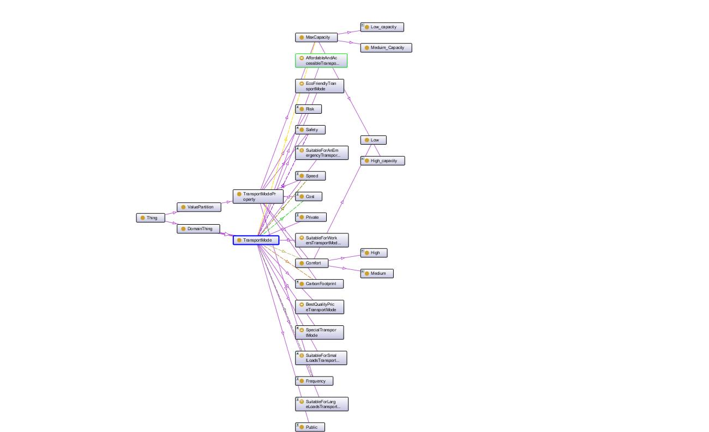
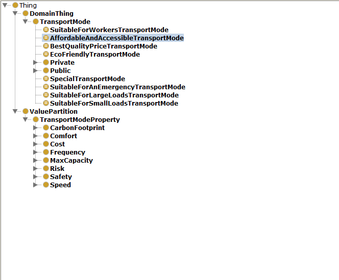
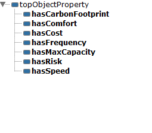
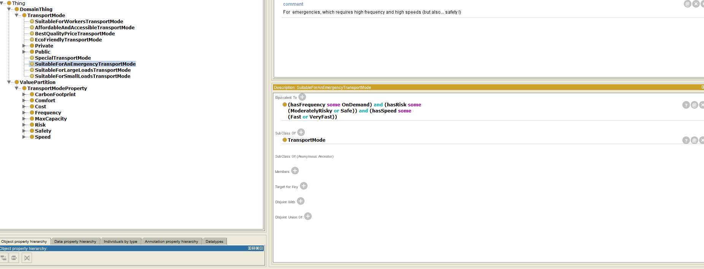
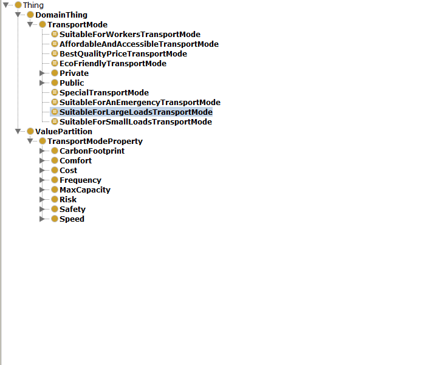
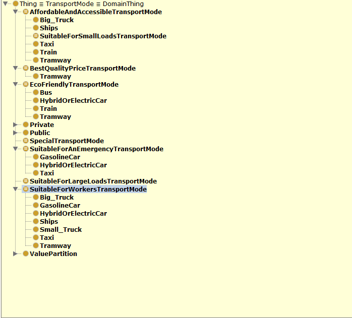

# Industrial transportation mechanisms

Industrial transportation mechanisms play a crucial role in modern manufacturing and logistics. These systems facilitate the efficient movement of materials, products, and components within factories, and distribution centers, ensuring seamless operations and minimizing downtime. They encompass a wide range of technologies and equipment designed to handle diverse industrial transportation needs.

## Description of the ontology

The ontology is designed to support a decision-making transport choice and relies on characteristics of
the different transport modes taking into account industry choices, constraints or limits such as economic

## Structure

There are two important classes DomainThing and
ValuePartition. DomainThing are modes that exist in a
structured way.These transport modes correspond to the domains of the defined object properties. For defining the characteristics of the transport modes TransportModeProperty in the class
ValuePartition is created.

## Object properties

The object properties are defined to characterize the
different modes of transport and built in a mirror-like
manner with the ValuePartition class.

## The inferred classes

The class DomainThing is also composed of other classes which are completed after running the reasoner. These classes are the basis of the recommendation system and can be seen as categorization inferred classes.
these classes are defined for account different type of situation in industry transportation mechanism.

## The ontology before and after running the reasoner

### Before running the reasoner

### After running the reasoner

